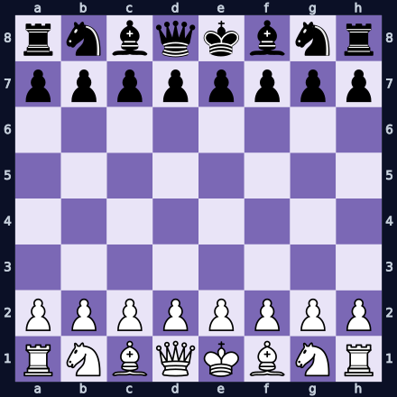

  
  
  
  
  

### 🛠️ Toolbox

  
   
  
  
  
  

### 🚀 Launch log

5+ years building SaaS products and high-traffic platforms, mostly from Kabul and often for teams on the other side of the planet.

| | Mission | Payload |
| :-: | :-- | :-- |
| 🏢 | **Senior Frontend / Full Stack Developer** [NETLINKS](https://github.com/NETLINKSAF) · 2023 → now | Leading [hr.jobs.af](https://hr.jobs.af), Afghanistan's largest applicant tracking system. Tuning [jobs.af](https://jobs.af), the country's first and biggest job portal. HR systems for NGOs like AfghanAid and MSI Reproductive Choices. |
| 🏠 | **Senior Web Developer** HareerLiving · St. Pete, FL (remote) · 2025 → 2026 | TypeScript/React platforms for Hareer Living and Aries Corporate Housing, plus backend services that automate housing workflows |
| 📚 | **Full Stack Developer** Startupistan · 2024 → 2025 | A secure learning platform for Afghan youth, built to stay fast on low bandwidth |
| 🧑‍🏫 | **Technical Mentor** Microverse · 2023 | Code reviews, clean-code coaching, stand-ups and pair programming with junior devs |
| 🔌 | **Backend Developer** KUDSIC · 2022 | REST APIs and relational schema design; first steps into mentoring |

🎓 **B.S. Computer Science, Kabul University**, Best Student Award, plus an encrypted document-transmission system for the university · Microverse Full Stack program

**Side quests:** [AutoRent](https://github.com/BahirHakimy/autorent) (DRF + React + Stripe) · [Doosti](https://github.com/BahirHakimy/DoostiApp) (social app) · [The Sky](https://github.com/BahirHakimy/the-sky) (weather) · ✍️ [JavaScript, how to code like a &lt;pro/&gt;](https://medium.com/@bahirhakimy2020)

<b>📊 Stats</b>

 

  
  

<!-- CHESS:START -->

## ♟️ Community Chess

One game, played by everyone who visits. **Click a move below** to open an issue, then hit *Create*. A GitHub Action plays it and redraws the board. You can't move twice in a row, so bring a friend.

<b>Game #1</b>, move 1: <b>⚪ White</b> to play

<b>Pick a move (20 legal)</b>

| Piece | From | Moves |
| :-- | :-: | :-- |
| ♘ Knight | `b1` | [Na3](https://github.com/BahirHakimy/BahirHakimy/issues/new?title=chess%7Cmove%7Cb1a3&body=Just%20press%20Create.%20A%20bot%20plays%20your%20move%20within%20a%20minute.) · [Nc3](https://github.com/BahirHakimy/BahirHakimy/issues/new?title=chess%7Cmove%7Cb1c3&body=Just%20press%20Create.%20A%20bot%20plays%20your%20move%20within%20a%20minute.) |
| ♘ Knight | `g1` | [Nf3](https://github.com/BahirHakimy/BahirHakimy/issues/new?title=chess%7Cmove%7Cg1f3&body=Just%20press%20Create.%20A%20bot%20plays%20your%20move%20within%20a%20minute.) · [Nh3](https://github.com/BahirHakimy/BahirHakimy/issues/new?title=chess%7Cmove%7Cg1h3&body=Just%20press%20Create.%20A%20bot%20plays%20your%20move%20within%20a%20minute.) |
| ♙ Pawn | `a2` | [a3](https://github.com/BahirHakimy/BahirHakimy/issues/new?title=chess%7Cmove%7Ca2a3&body=Just%20press%20Create.%20A%20bot%20plays%20your%20move%20within%20a%20minute.) · [a4](https://github.com/BahirHakimy/BahirHakimy/issues/new?title=chess%7Cmove%7Ca2a4&body=Just%20press%20Create.%20A%20bot%20plays%20your%20move%20within%20a%20minute.) |
| ♙ Pawn | `b2` | [b3](https://github.com/BahirHakimy/BahirHakimy/issues/new?title=chess%7Cmove%7Cb2b3&body=Just%20press%20Create.%20A%20bot%20plays%20your%20move%20within%20a%20minute.) · [b4](https://github.com/BahirHakimy/BahirHakimy/issues/new?title=chess%7Cmove%7Cb2b4&body=Just%20press%20Create.%20A%20bot%20plays%20your%20move%20within%20a%20minute.) |
| ♙ Pawn | `c2` | [c3](https://github.com/BahirHakimy/BahirHakimy/issues/new?title=chess%7Cmove%7Cc2c3&body=Just%20press%20Create.%20A%20bot%20plays%20your%20move%20within%20a%20minute.) · [c4](https://github.com/BahirHakimy/BahirHakimy/issues/new?title=chess%7Cmove%7Cc2c4&body=Just%20press%20Create.%20A%20bot%20plays%20your%20move%20within%20a%20minute.) |
| ♙ Pawn | `d2` | [d3](https://github.com/BahirHakimy/BahirHakimy/issues/new?title=chess%7Cmove%7Cd2d3&body=Just%20press%20Create.%20A%20bot%20plays%20your%20move%20within%20a%20minute.) · [d4](https://github.com/BahirHakimy/BahirHakimy/issues/new?title=chess%7Cmove%7Cd2d4&body=Just%20press%20Create.%20A%20bot%20plays%20your%20move%20within%20a%20minute.) |
| ♙ Pawn | `e2` | [e3](https://github.com/BahirHakimy/BahirHakimy/issues/new?title=chess%7Cmove%7Ce2e3&body=Just%20press%20Create.%20A%20bot%20plays%20your%20move%20within%20a%20minute.) · [e4](https://github.com/BahirHakimy/BahirHakimy/issues/new?title=chess%7Cmove%7Ce2e4&body=Just%20press%20Create.%20A%20bot%20plays%20your%20move%20within%20a%20minute.) |
| ♙ Pawn | `f2` | [f3](https://github.com/BahirHakimy/BahirHakimy/issues/new?title=chess%7Cmove%7Cf2f3&body=Just%20press%20Create.%20A%20bot%20plays%20your%20move%20within%20a%20minute.) · [f4](https://github.com/BahirHakimy/BahirHakimy/issues/new?title=chess%7Cmove%7Cf2f4&body=Just%20press%20Create.%20A%20bot%20plays%20your%20move%20within%20a%20minute.) |
| ♙ Pawn | `g2` | [g3](https://github.com/BahirHakimy/BahirHakimy/issues/new?title=chess%7Cmove%7Cg2g3&body=Just%20press%20Create.%20A%20bot%20plays%20your%20move%20within%20a%20minute.) · [g4](https://github.com/BahirHakimy/BahirHakimy/issues/new?title=chess%7Cmove%7Cg2g4&body=Just%20press%20Create.%20A%20bot%20plays%20your%20move%20within%20a%20minute.) |
| ♙ Pawn | `h2` | [h3](https://github.com/BahirHakimy/BahirHakimy/issues/new?title=chess%7Cmove%7Ch2h3&body=Just%20press%20Create.%20A%20bot%20plays%20your%20move%20within%20a%20minute.) · [h4](https://github.com/BahirHakimy/BahirHakimy/issues/new?title=chess%7Cmove%7Ch2h4&body=Just%20press%20Create.%20A%20bot%20plays%20your%20move%20within%20a%20minute.) |

<!-- CHESS:END -->

